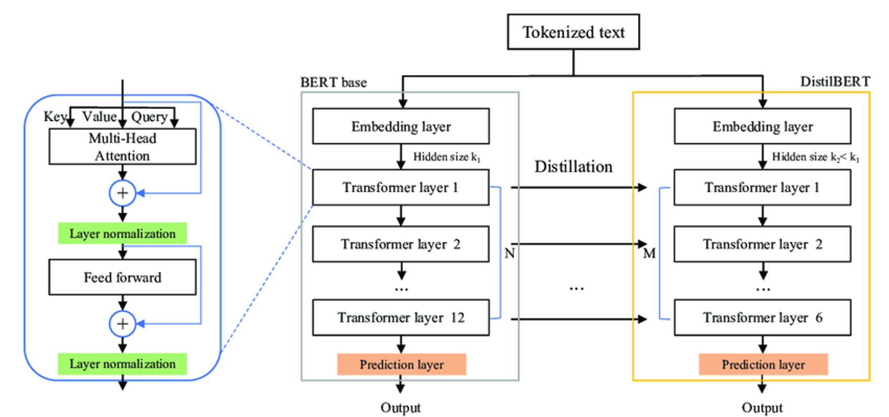
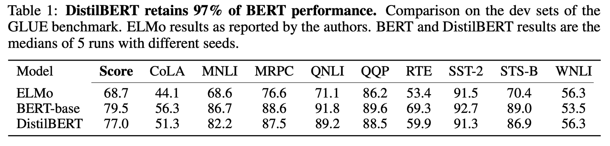
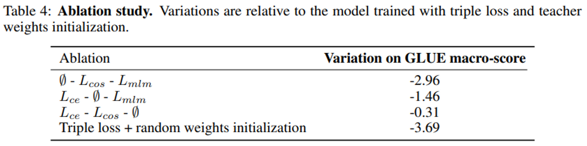

# Context Prediction
- Title: Unsupervised Visual Representation Learning by Context Prediction
- Publication: ICCV, 2015
- Link: [[paper](https://arxiv.org/pdf/1505.05192.pdf)] [[code](https://github.com/open-mmlab/mmselfsup/tree/main/configs/selfsup/relative_loc)]

## Abstract
- Given only a large, unlabeled image collection, extract random pairs of patches from each image.
- And train a convolutional neural net to predict the position of the second patch relative to the first.

## Introduction
- “self-supervised” formulation for image data: a supervised task, predicting the context for a patch.
- In training, the algorithm must guess the positon of one patch relative to the other.

## Tasks: sampling random pairs of patches

# continue from here!

### Mechanism of DistilBERT
- Student BERT model completely removes NSP from BERT.
- Therefore, the token type embedding (segment embedding) is removed, and the last pooler is also removed.
  - Pooler: Compressing token representations into one fixed vector through an additional layer
  - Due to the absence of a pooler, distilBERT cannot directly obtain sentence-level expressions
- Learning with a very large batch size (4K data per batch)
- NSP is not used, and dynamic masking is used which is RoBERTa's trick. Create a different mask for each input
- Halve the number of layers.
  -  Reducing dimensions doesn't have a significant impact on speed improvement.
  -  Reducing the number of layers can directly reduce the amount of computation.
- As a result, it has a 40% smaller size and speeds up to 60% faster


### Loss functions
- soft target loss(Lce): calculate between soft target and soft prediction
- hard target loss(Lmin): calcualate between hard target and hard prediction
  - MLM(Masked Language Model) loss used in BERT
- cosine embedding loss(Lcos): embed directions of hidden vectos between teacher model and student model
  - Adjust both vectors to face the same direction

## Performance of DistilBERT
- DistilBERT retains 97% of BERT performance

- DistilBERT is significantly smaller while being constantly faster.

- Ablation study: hard target loss(Lmin) has the least impact, score drops significantly when resetting to random weight


## Reference
```tex
@article{DBLP:journals/corr/DoerschGE15,
  author       = {Carl Doersch and
                  Abhinav Gupta and
                  Alexei A. Efros},
  title        = {Unsupervised Visual Representation Learning by Context Prediction},
  journal      = {CoRR},
  volume       = {abs/1505.05192},
  year         = {2015},
  url          = {http://arxiv.org/abs/1505.05192},
  eprinttype    = {arXiv},
  eprint       = {1505.05192},
  timestamp    = {Fri, 05 Apr 2019 07:29:46 +0200},
  biburl       = {https://dblp.org/rec/journals/corr/DoerschGE15.bib},
  bibsource    = {dblp computer science bibliography, https://dblp.org}
}
```
