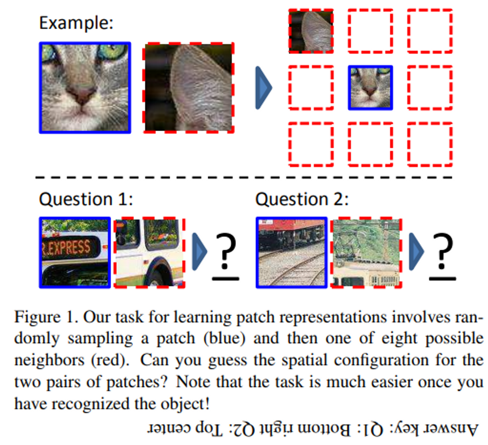
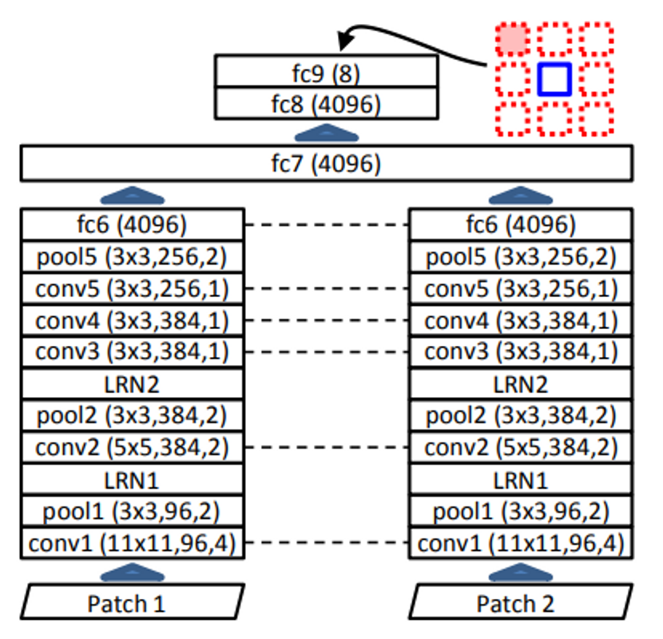
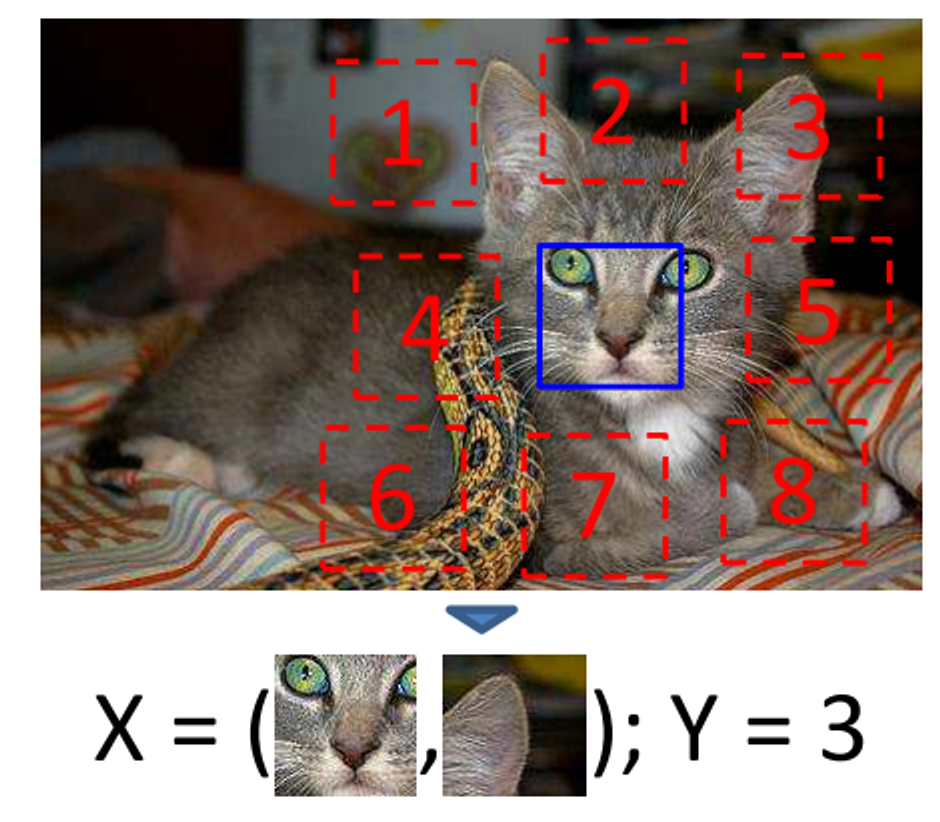
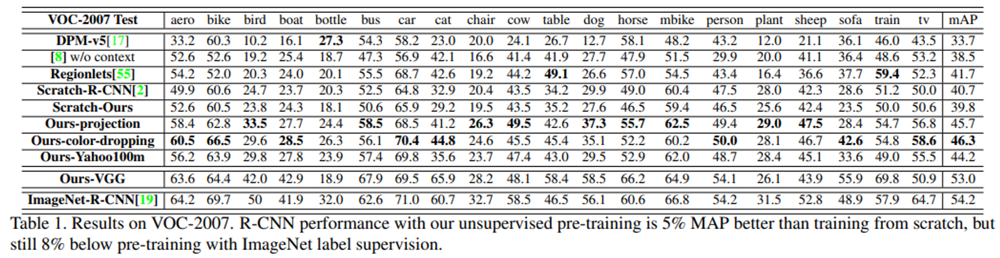

# Context Prediction
- Title: Unsupervised Visual Representation Learning by Context Prediction
- Publication: ICCV, 2015
- Link: [[paper](https://arxiv.org/pdf/1505.05192.pdf)] [[code](https://github.com/open-mmlab/mmselfsup/tree/main/configs/selfsup/relative_loc)]

## Abstract
- Given only a large, unlabeled image collection, extract random pairs of patches from each image.
- And train a convolutional neural net to predict the position of the second patch relative to the first.

## Introduction
- “self-supervised” formulation for image data: a supervised task, predicting the context for a patch.
- In training, the algorithm must guess the positon of one patch relative to the other.

## Tasks: sampling random pairs of patches
1. Sample random pairs of patches in one of eight spatial configurations
    * Present each pair to a machine learner, providing no information about the patches’ original position within the image.

2. Context prediction
    * Embedding where images that are semantically similar are close, while semantically different ones are far apart.
- Visual presentation showed good performance in object detection and improved performance over learning in scratch (initial state)
- This means that whether the patch is assigned to the correct number (instance-level supervision) can improve the performance of the category-level task.

## Architecture for pair classification
- How can the architecture predict relative offsets betweent two patches?
    * Goal: to learn feature embedding for individual patches so that similar image patches are located close.
    * The network receives two patches and is designed to return probabilities to each of the eight choices.
- Implement late-fusion architecture with two AlexNet pairs
    * In AlexNet-style model, first to fc6 layer is a separate process.
    * Calculate the embedding function using the same weight.
    * Only two layers use two patches of data, the network must proceed with most semantic reasoning separately for each patch.


## Avoiding "trivial" solutions
- It is important to extract features without trivial shortcuts.
- To avoid trivial solutions, two methods are used.
    1. Put the gaps between patches. (about half the size of the patch)
    2. Randomly move patches up to 7 pixels to prevent something like a running line between patches.


## Implement details
1. Resize the image by maintaining the ratio of the number of pixels between 150K and 450K
2. Sample the 96*96 size patch from the image. (For the efficiency of the calculation, it is only sampled in grid form.)
3. Mean subtraction - dropping color - Randomly downsampling less than 100 patches for some patches
4. Upsampling for robustness
    *  The activation of fc6, fc7 dropped to zero, worsening the output vector to have an even value in all eight categories.
    *  Using batch normalization to keep network activities changing

## Results in object detection
- Results of fine-tuning CNNs learned by Context Prediction to R-CNN in object detection
    * Performance is lower than fine-tuned with Image-Net.
    * But it performs better at mean average precision than pre-trained Scratch-R-CNN.
- Yahoo/Flickr 100-million Dataset: To compare effect of variable dataset biases together
- Performance is slightly lower than color dropping, but there is still rrom for boosting because it is a scratch model.


## Reference
```tex
@article{DBLP:journals/corr/DoerschGE15,
  author       = {Carl Doersch and
                  Abhinav Gupta and
                  Alexei A. Efros},
  title        = {Unsupervised Visual Representation Learning by Context Prediction},
  journal      = {CoRR},
  volume       = {abs/1505.05192},
  year         = {2015},
  url          = {http://arxiv.org/abs/1505.05192},
  eprinttype    = {arXiv},
  eprint       = {1505.05192},
  timestamp    = {Fri, 05 Apr 2019 07:29:46 +0200},
  biburl       = {https://dblp.org/rec/journals/corr/DoerschGE15.bib},
  bibsource    = {dblp computer science bibliography, https://dblp.org}
}
```
