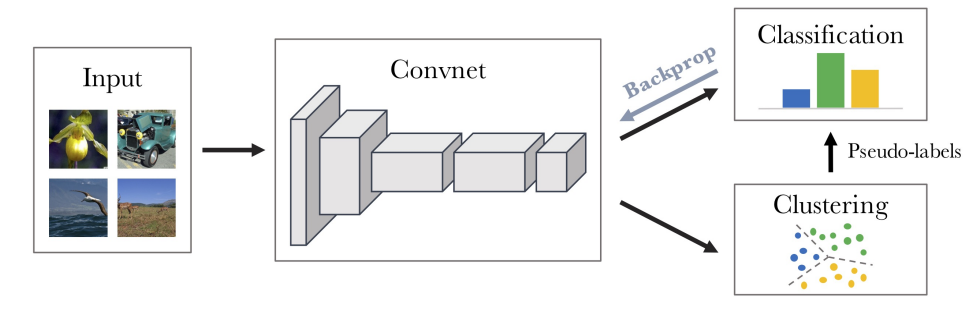
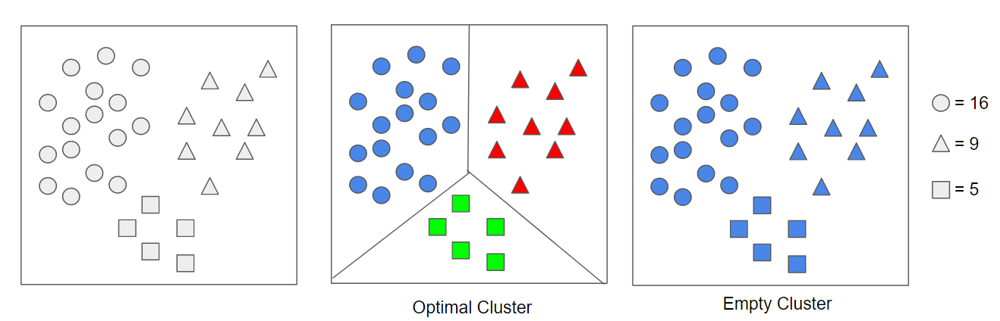
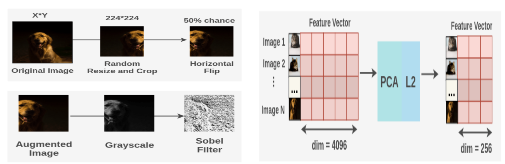
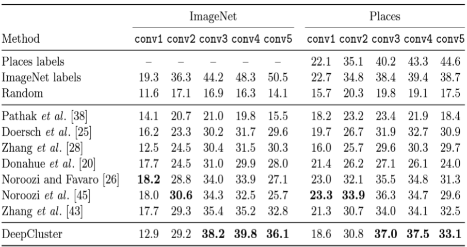

# DeepCluster
- Title: Deep Clustering for Unsupervised Learning of Visual Features
- Publication: ECCV, 2018
- Link: [[paper](https://arxiv.org/pdf/1807.05520.pdf)] [[code](https://github.com/facebookresearch/deepcluster)]



## Introduce 
- When θ is sampled from a Gaussian distribution, without any learning, fθ does not produce good features.
- However the performance of such random features on standard transfer tasks, is far above the chance level. 
- The last convolutional layer of a random AlexNet achieves 12% in accuracy on ImageNet while the chance is at 0.1%
- Using this weak signals, the output of the convnet (feature label) is clustered and optimized using them as pseudo-labels.
- Clustering learns the decision boundary between classes, and if an empty cluster is not considered, assigning all data to one cluster is also regarded as an optimal cluster.
- Therefore, to prevent this, the empty cluster problem was solved by reallocating the centeriod of an empty cluster to a non-empty cluster.
- The second problem is trivial parameterization, which is a phenomenon that occurs in the same way with imbalanced data.
- Avoiding Trivial Solutions.
    - Empty clusters → Reassign cluster
    - Trivial parameterization → Contribute the weight of an input to the loss function by the inverse of the size of its assigned cluster

 

## Implementation
- Data Processing
  - Transformation for clustering(resize, crop, horizontal flip, Sobel filter: edge detect)
- Feature processing
  - PCA(Principal Component Analysis): Dimension reduction, L2-regularization
- Decide number of clusters(classes): k  =10,000
  - Setting up many clusters has a fine-grained grouping effect.
 

## Experiment Results.
- Train a linear classifier on top of different frozen convolutional layers.
- Linear classification on ImageNet and Places using activations from the convolutional layers of an AlexNet as features.
- On ImageNet, DeepCluster outperforms the state of the art from conv3 to conv5 layers by 3−5%.
 

## Reference
```tex
@article{DBLP:journals/corr/abs-1807-05520,
  author       = {Mathilde Caron and
                  Piotr Bojanowski and
                  Armand Joulin and
                  Matthijs Douze},
  title        = {Deep Clustering for Unsupervised Learning of Visual Features},
  journal      = {CoRR},
  volume       = {abs/1807.05520},
  year         = {2018},
  url          = {http://arxiv.org/abs/1807.05520},
  eprinttype    = {arXiv},
  eprint       = {1807.05520},
  timestamp    = {Mon, 13 Aug 2018 16:46:44 +0200},
  biburl       = {https://dblp.org/rec/journals/corr/abs-1807-05520.bib},
  bibsource    = {dblp computer science bibliography, https://dblp.org}
}
```
