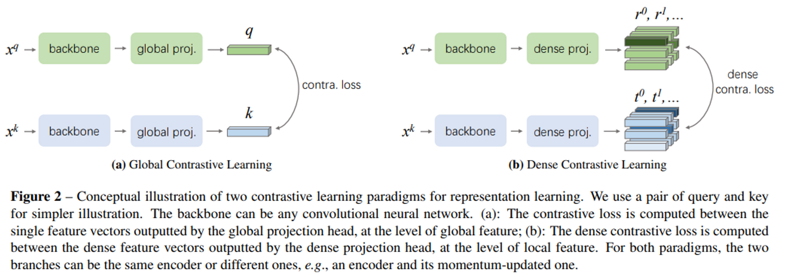
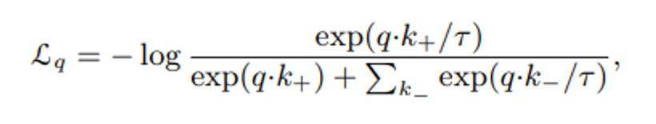
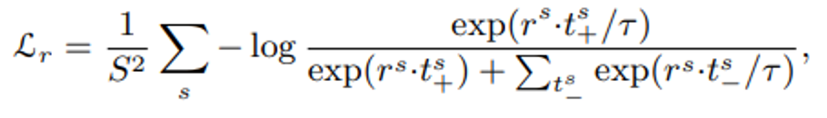
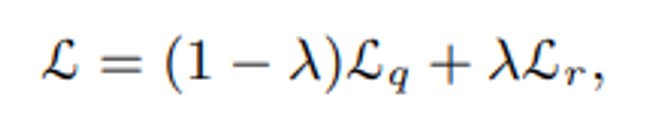
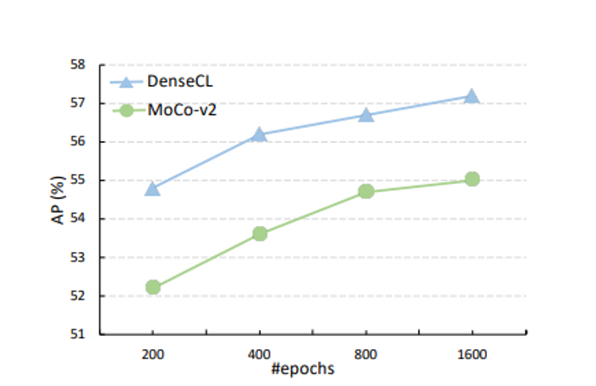
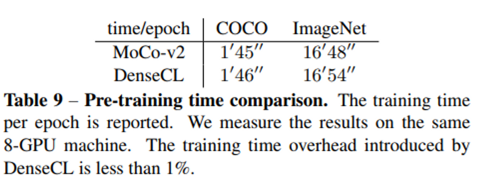
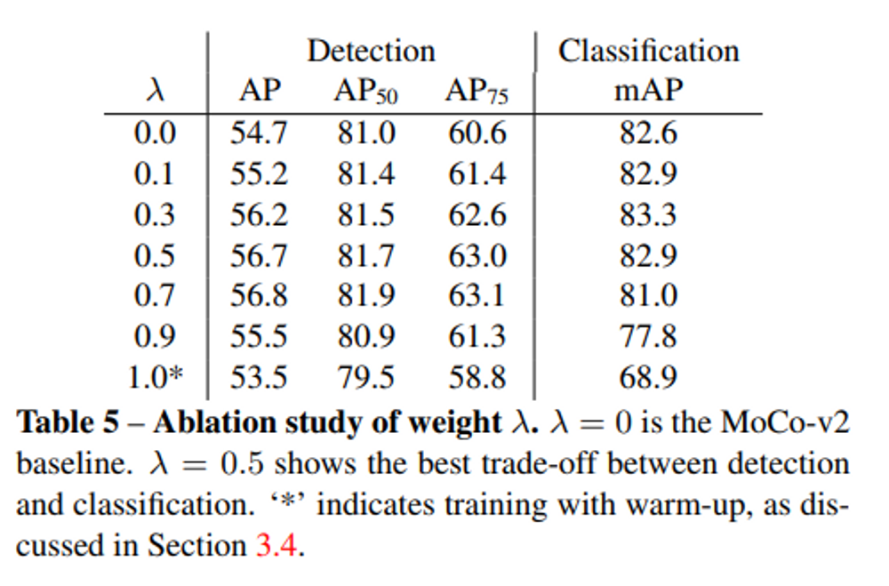
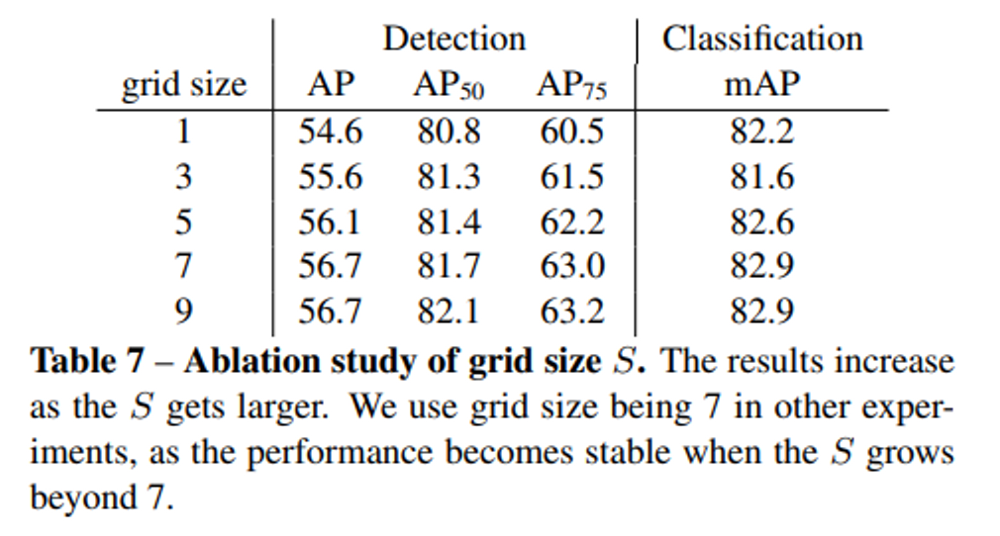

# DenseCL
- Title: Dense Contrastive Learning for Self-Supervised Visual Pre-Training
- Publication: CVPR, 2021
- Link: [[paper](https://arxiv.org/pdf/2011.09157.pdf)] [[code](https://github.com/WXinlong/DenseCL)]

## Abstract
- The pre-trained model is a sub-optimal! (not ideally a perfect model).
- This is because of the discrepancy between image-level prediction and pixel-level prediction.
- Implementing self-supervised learning with similarity at pixel level between two images.

## Introduction
- There a difference between image classification pre-training and target sense prediction. (object detection)
  - classification determines categories for input.
  - Object detection requires overall sense classification or regression for one input.
- DenseCL: for self-supervisively learning visual pre-training, pixel-wise learning.
- Use the dense projection head that receives input from the backbone network: Extract the dense feature map and apply continuous learning for each vector between the feature maps.


## Pipeline of DenseCL
1. Extract the dense feature map using the backbone network and move it to the projection head.
2. Two parallel sub-heads are formed in the projection head, named global projection head and dense projection head.
3. projection head generates feature vectors.
  - global projection head: use dense feature map as input and generate global feature vector.
  - dense projection head:  use dense feature map as input and generate dense feature vector.
  - At the dense projection head, global pooling layers are removed and MLP are substituted with 1x1 conv.   
4. Learning in the direction of improving the contrastive similarity loss of global and local features.
- Lq: is the global loss (like MoCo)


- Lr: is the local loss 


- Use two losses combining with Lq and Lr


- If λ=0, it is the same as MoCo v2, and the default setting is λ=0.5.
- If λ=1, it means that global information does not used.
  - Chicken-and-egg issue: Problems that can occur when λ=1.
  - So if the feature is not good enough, cannot be able to learn properly.
- A kind of deadlock problem: trying to solve the problem by initializing it with the weight of the pre-trained model or using the warm-up period.

## Experiments
- Dense prediction-related downstream tasks perform well.
- Better than backbone in average precision, even better than supervised learning. (super. IN)


- The more epochs are used, the better the performance.


- The time comsuming per 1 epoch, there are few difference between DenseCL and MoCo v2.


## Ablation study
- Performance change according to the lambda value, if lambda is 0, it is the same as MoCo v2. (Looking at the global only)
- The best performance when lambda is 0.8.


- The best performance when grid size is greater than 7.


## Reference
```tex
@article{DBLP:journals/corr/abs-2011-09157,
  author       = {Xinlong Wang and
                  Rufeng Zhang and
                  Chunhua Shen and
                  Tao Kong and
                  Lei Li},
  title        = {Dense Contrastive Learning for Self-Supervised Visual Pre-Training},
  journal      = {CoRR},
  volume       = {abs/2011.09157},
  year         = {2020},
  url          = {https://arxiv.org/abs/2011.09157},
  eprinttype    = {arXiv},
  eprint       = {2011.09157},
  timestamp    = {Thu, 09 Dec 2021 18:10:29 +0100},
  biburl       = {https://dblp.org/rec/journals/corr/abs-2011-09157.bib},
  bibsource    = {dblp computer science bibliography, https://dblp.org}
}
```
