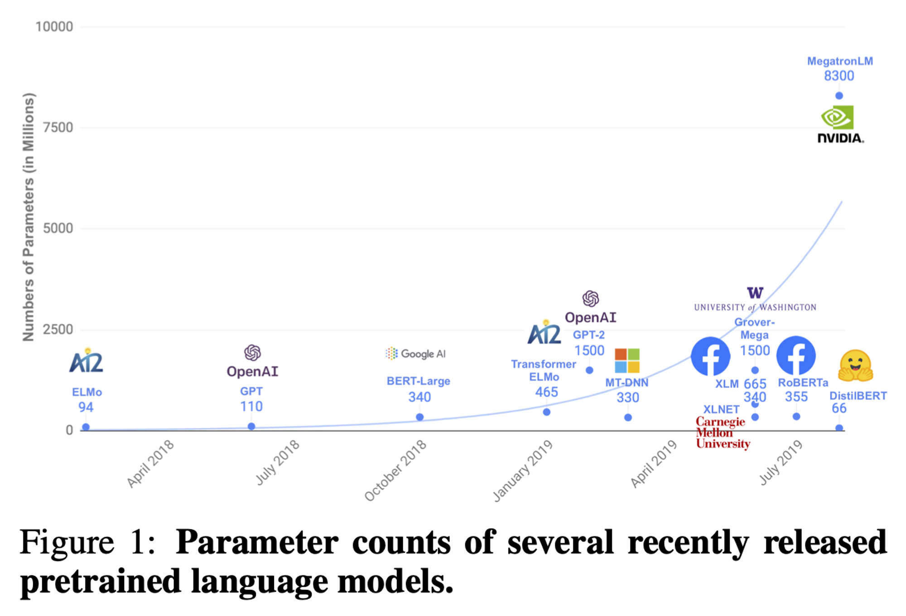
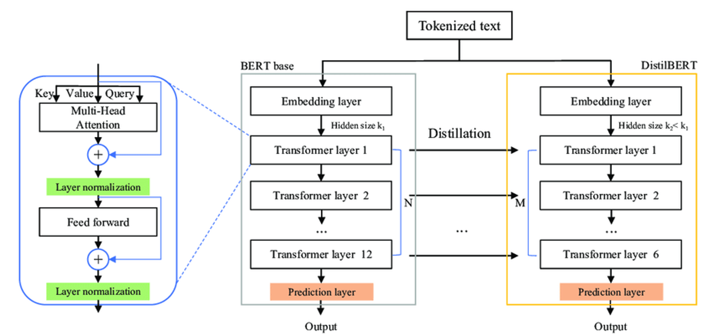
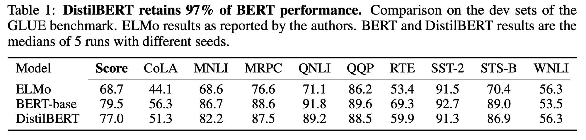
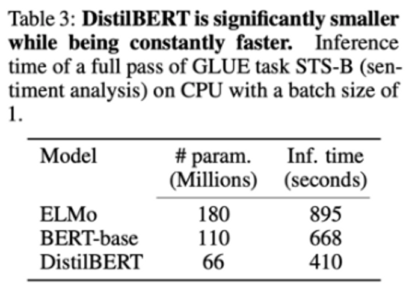
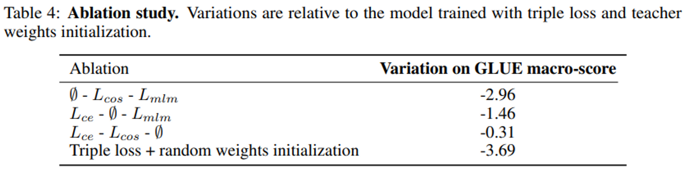

# DistilBERT
- Title: DistilBERT, a distilled version of BERT: smaller, faster, cheaper and lighter
- Publication: NIPS, 2019
- Link: [[paper](https://arxiv.org/pdf/1910.01108.pdf)] [[code](https://github.com/huggingface/transformers/blob/main/src/transformers/models/distilbert/modeling_distilbert.py)]

## Abstract
- Pre-train a smaller general purpose language representation model, called DistilBERT
- It propose a way to distill knowledge from once-trained large-scale machine learning (or models) to a small model

## Problems with Existing Models
- The computational cost is too high.
- Increasing computational cost and memory requirements will be difficult to use unless resources are available.


## DistilBERT: a distilled version of BERT

### Mechanism of DistilBERT
- Student BERT model completely removes NSP from BERT.
- Therefore, the token type embedding (segment embedding) is removed, and the last pooler is also removed.
  - Pooler: Compressing token representations into one fixed vector through an additional layer
  - Due to the absence of a pooler, distilBERT cannot directly obtain sentence-level expressions
- Learning with a very large batch size (4K data per batch)
- NSP is not used, and dynamic masking is used which is RoBERTa's trick. Create a different mask for each input
- Halve the number of layers.
  -  Reducing dimensions doesn't have a significant impact on speed improvement.
  -  Reducing the number of layers can directly reduce the amount of computation.
- As a result, it has a 40% smaller size and speeds up to 60% faster


### Loss functions
- soft target loss(Lce): calculate between soft target and soft prediction
- hard target loss(Lmin): calcualate between hard target and hard prediction
  - MLM(Masked Language Model) loss used in BERT
- cosine embedding loss(Lcos): embed directions of hidden vectos between teacher model and student model
  - Adjust both vectors to face the same direction

## Performance of DistilBERT
- DistilBERT retains 97% of BERT performance

- DistilBERT is significantly smaller while being constantly faster.

- Ablation study: hard target loss(Lmin) has the least impact, score drops significantly when resetting to random weight


## Reference
```tex
@article{DBLP:journals/corr/abs-1910-01108,
  author       = {Victor Sanh and
                  Lysandre Debut and
                  Julien Chaumond and
                  Thomas Wolf},
  title        = {DistilBERT, a distilled version of {BERT:} smaller, faster, cheaper
                  and lighter},
  journal      = {CoRR},
  volume       = {abs/1910.01108},
  year         = {2019},
  url          = {http://arxiv.org/abs/1910.01108},
  eprinttype    = {arXiv},
  eprint       = {1910.01108},
  timestamp    = {Tue, 02 Jun 2020 12:48:59 +0200},
  biburl       = {https://dblp.org/rec/journals/corr/abs-1910-01108.bib},
  bibsource    = {dblp computer science bibliography, https://dblp.org}
}
```
