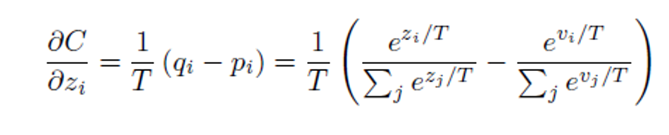
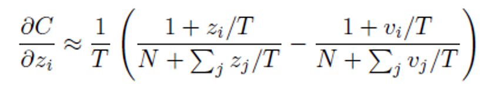
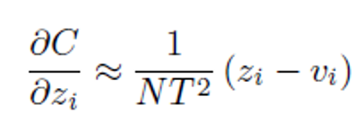
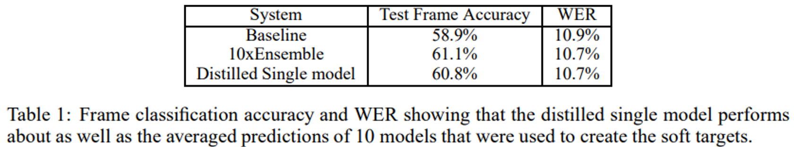

# DistilBERT
- Title: DistilBERT, a distilled version of BERT: smaller, faster, cheaper and lighter
- Publication: NIPS, 2019
- Link: [[paper](https://arxiv.org/pdf/1910.01108.pdf)] [[code](https://github.com/huggingface/transformers/blob/main/src/transformers/models/distilbert/modeling_distilbert.py)]

## Abstract
- Pre-train a smaller general purpose language representation model, called DistilBERT
- It propose a way to distill knowledge from once-trained large-scale machine learning (or models) to a small model

## Problems with Existing Models
- The computational cost is too high.
- Increasing computational cost and memory requirements will be difficult to use unless resources are available.

## Knowledge distillation used in DistilBERT

## Matching logits is a special case of distillation
  - v: combersome, p: soft target
- When the Cross entropy is differentiated by logit(z), it is as follows.


- At this time, if T is greater than logit, it is possible to approximate exp = 1 + ε.


- If distillation is done well, it can be assumed that logit has zero-mean.
- So the sigma can be ignored.


- If the temperature is small, the distribution function of the soft target decreases to a degree that is close to one-hot encoding.
  - Decrease the difference between negative logs
- If the temperature is large, it becomes soft and the value for the negative logit of the soft target is larger
  - So the difference from the negative logit of the distributed model is larger.

## Experiment
- If there are more than 300 units per layer, all similar results in t ≥ 8 in MNIST.
  - If the number of units is drastically reduced to about 30 per layer, it shows optimal performance at 2.5 ≤ t ≤ 4.
- The accuracy of the model using distill is observed, and the word error is also low. in speech recognition.


## Reference
```tex
@article{DBLP:journals/corr/abs-1910-01108,
  author       = {Victor Sanh and
                  Lysandre Debut and
                  Julien Chaumond and
                  Thomas Wolf},
  title        = {DistilBERT, a distilled version of {BERT:} smaller, faster, cheaper
                  and lighter},
  journal      = {CoRR},
  volume       = {abs/1910.01108},
  year         = {2019},
  url          = {http://arxiv.org/abs/1910.01108},
  eprinttype    = {arXiv},
  eprint       = {1910.01108},
  timestamp    = {Tue, 02 Jun 2020 12:48:59 +0200},
  biburl       = {https://dblp.org/rec/journals/corr/abs-1910-01108.bib},
  bibsource    = {dblp computer science bibliography, https://dblp.org}
}
```
