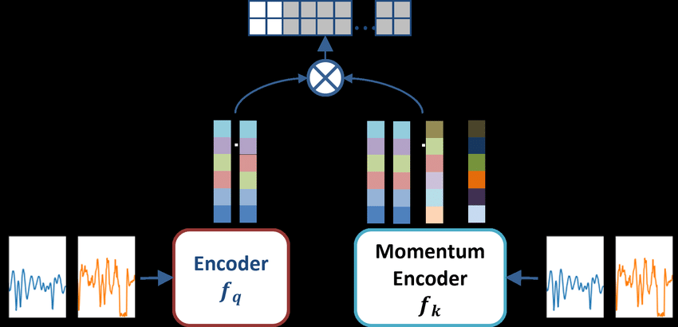
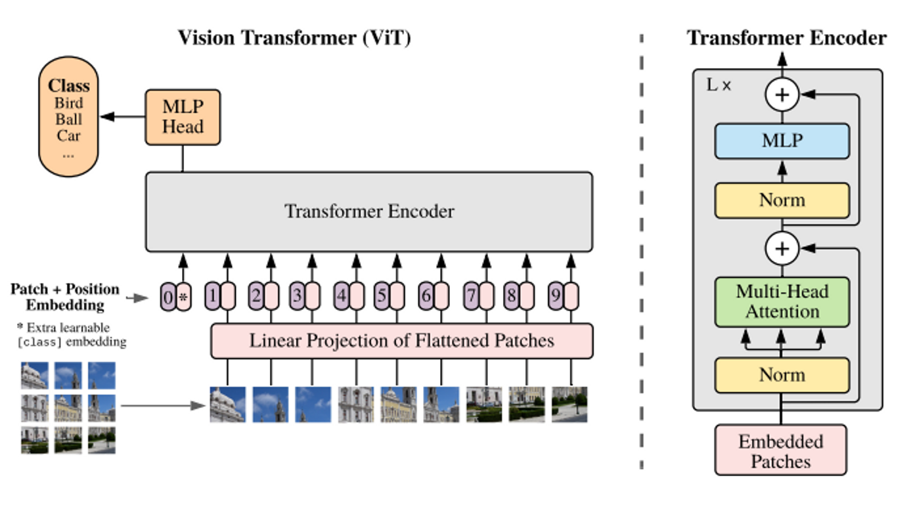
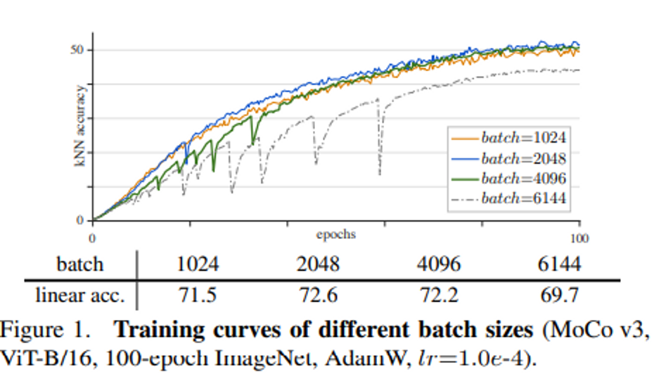
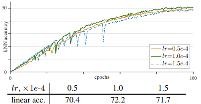
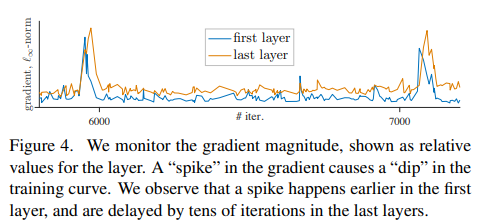
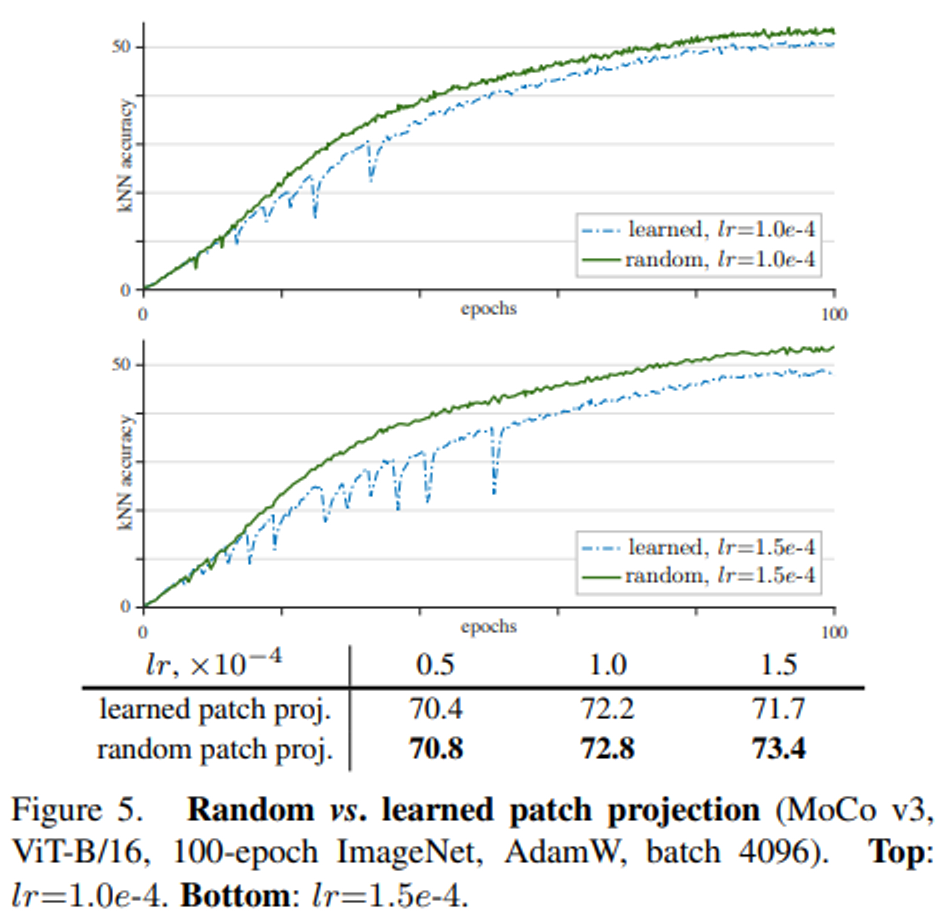
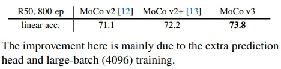
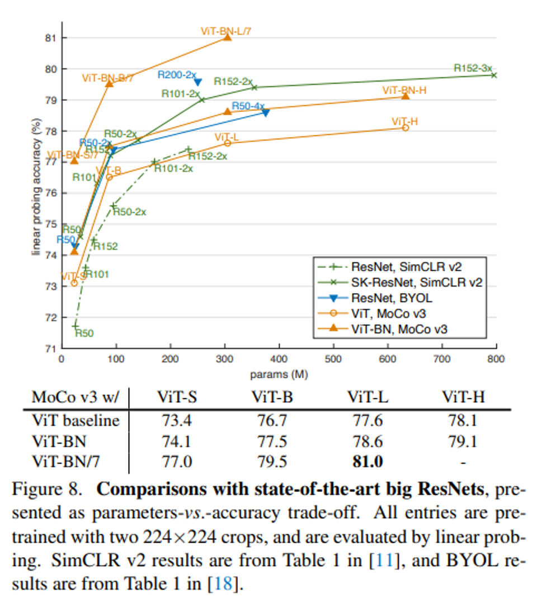

# Knowledge Distillation
- Title: Distilling the Knowledge in a Neural Network
- Publication: NIPS, 2014
- Link: [[paper](https://arxiv.org/pdf/1503.02531.pdf)] [[code](https://github.com/SforAiDl/KD_Lib)]

## Abstract
- keywords
  - No More Using ResNet: Using Vision Transformers (ViT) for self-supervised learning
  - Freeze the patch projection to improve stability.

## Features of MoCo v3
- Using a transformer-based ViT model
- Deleting a dynamic dictionary of a queue structure which is a key keyword in MoCo v1
  - Comparing to negative sample inside the batch using a huge batch size like SimCLR
- Configure query encoder by adding prediction head over MLP head
- The projection head is 3-layer MLP, and 2-layer MLP is applied as a prediction head (including BN)

- The continuous loss function uses the existing one.

## Brief introduction to vit
1. Split image into fixed patches.
2. The divided patch is combined with the class token to perform patch embedding, and position embedding is added to maintain location information.
3. Transfer the above embedding result to the encoder
- Input patch size: 16×16 or 14×14, so if you spread it out, the length is 196 and 256.
  - After that, each position embedding is performed, using 2D to representation spatial information better.
 

## Empirical Observations on Basic Factors
1. Batch size: a batch of 1k and 2k produces reasonably smooth curves, 4k and 6k have worse failure patterns
- It hypothesized that the training is partially restarted and jumps out of the current local optimum, then seeks a new trajectory.
- As a consequence, the training does not diverge, but the accuracy depends on how good the local restart is


2. Learning rate: when lr is smaller, the training is more stable, but it is prone to under-fitting.
- Conversely, if the learning rate is large, it is less stable and accuracy is reduced.
 

## A Trick for Improving Stability
- Freeze the first layer: Do not learn the layer that converts patch to embedded
  - Use a fixed random patch projection layer to embed the patches, which is not learned.
  - The instability of the first layer seems to be spreading backward, so I decided to freeze the patch projection layer.
 

- Compare Random patch projection vs Learned patch projections: Random patch projection's performance is better.
  - It is thought that overfitting would have been prevented because it is randomly selected without relying on the location of a particular pattern or object.
  - Same with SimCLR, BYOL, Random patch projection has higher performance


## Performance Comparison of MoCo v3
- When comparing MoCo series, the MoCo v3 has the highest performance.
  - The reason is that MoCo v3 has the bigger batch size and added extra prediction head
 

- It also shows excellent performance compared to the ResNet-based model.
 

## Reference
```tex
@article{DBLP:journals/corr/HintonVD15,
  author       = {Geoffrey E. Hinton and
                  Oriol Vinyals and
                  Jeffrey Dean},
  title        = {Distilling the Knowledge in a Neural Network},
  journal      = {CoRR},
  volume       = {abs/1503.02531},
  year         = {2015},
  url          = {http://arxiv.org/abs/1503.02531},
  eprinttype    = {arXiv},
  eprint       = {1503.02531},
  timestamp    = {Mon, 13 Aug 2018 16:48:36 +0200},
  biburl       = {https://dblp.org/rec/journals/corr/HintonVD15.bib},
  bibsource    = {dblp computer science bibliography, https://dblp.org}
}
```
