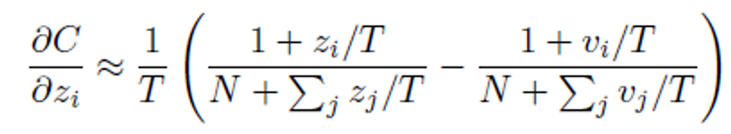

# Knowledge Distillation
- Title: Distilling the Knowledge in a Neural Network
- Publication: NIPS, 2014
- Link: [[paper](https://arxiv.org/pdf/1503.02531.pdf)] [[code](https://github.com/SforAiDl/KD_Lib)]

## Abstract
- One simple way to improve the performance of machine learning: Ensemble, but it has the disadvantage of high time latency and computational cost.
- It propose a way to distill knowledge from once-trained large-scale machine learning (or models) to a small model

## Distillation

### soft label
- Making small models perform well using the results of cumbesome
- T=1 is normal softmax, but introduces a new parameter called 'Temperature'
  - High T is used for transferring knowledge in cumbesome, and T=1 is used for small models (the bigger the T, the softer it becomes)


### hard label
- Cross entropy for correct label in small model (generally used in practice)

### distillation loss
- The above two losses are used as loss functions. Generally, the front is given large and the back is given small.
- This is because the robustness of the model can be improved by giving less weight to the Hard label.
  - Less sensitive to false labels and more responsive to noise.


## Matching logits is a special case of distillation
  - v: combersome, p: soft target
- When the Cross entropy is differentiated by logit(z), it is as follows.


- At this time, if T is greater than logit, it is possible to approximate exp = 1 + ε.


- If distillation is done well, it can be assumed that logit has zero-mean.
- So the sigma can be ignored.


- If the temperature is small, the distribution function of the soft target decreases to a degree that is close to one-hot encoding.
  - Decrease the difference between negative logs
- If the temperature is large, it becomes soft and the value for the negative logit of the soft target is larger
  - So the difference from the negative logit of the distributed model is larger.

## Experiment
- If there are more than 300 units per layer, all similar results in t ≥ 8 in MNIST.
  - If the number of units is drastically reduced to about 30 per layer, it shows optimal performance at 2.5 ≤ t ≤ 4.
- The accuracy of the model using distill is observed, and the word error is also low. in speech recognition.


## Reference
```tex
@article{DBLP:journals/corr/HintonVD15,
  author       = {Geoffrey E. Hinton and
                  Oriol Vinyals and
                  Jeffrey Dean},
  title        = {Distilling the Knowledge in a Neural Network},
  journal      = {CoRR},
  volume       = {abs/1503.02531},
  year         = {2015},
  url          = {http://arxiv.org/abs/1503.02531},
  eprinttype    = {arXiv},
  eprint       = {1503.02531},
  timestamp    = {Mon, 13 Aug 2018 16:48:36 +0200},
  biburl       = {https://dblp.org/rec/journals/corr/HintonVD15.bib},
  bibsource    = {dblp computer science bibliography, https://dblp.org}
}
```
