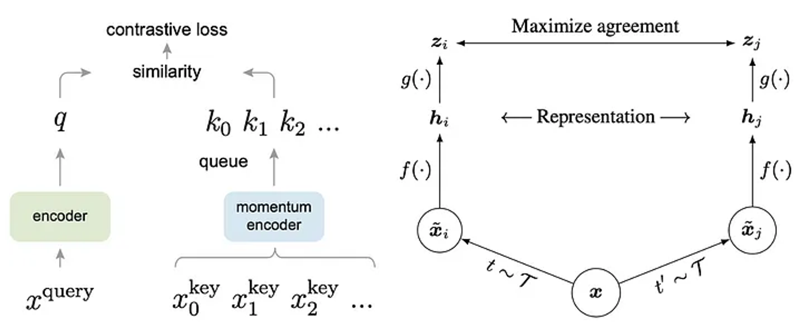
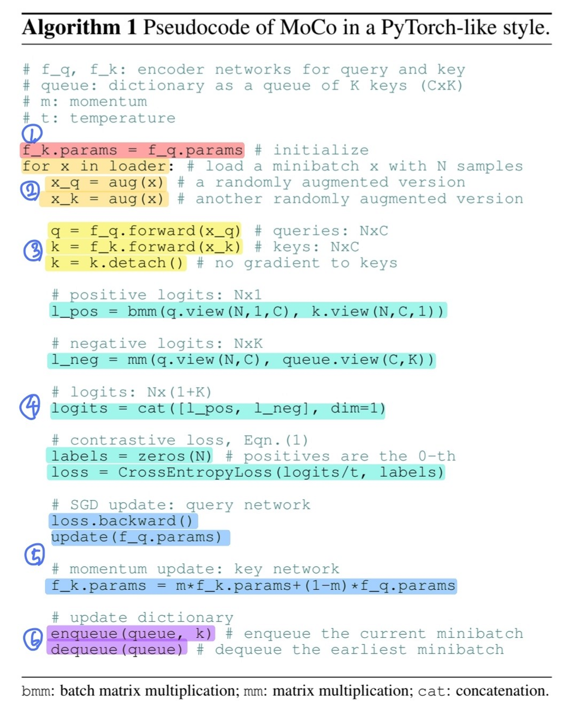
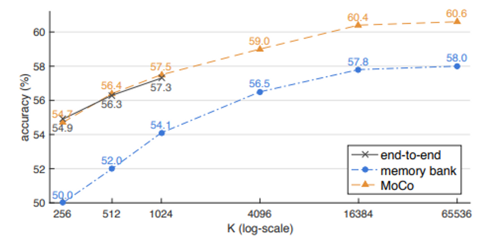

# MoCo v3
- Title: An Empirical Study of Training Self-Supervised Vision Transformers
- Publication: ICCV, 2021
- Link: [[paper](https://arxiv.org/abs/2104.02057.pdf)] [[code](https://github.com/facebookresearch/moco-v3)]

## Abstract
- keywords
  - No More Using ResNet: Using Vision Transformers (ViT) for self-supervised learning
  - Freeze the patch projection to improve stability.

## MoCo v3
- MoCo is an asymmetric structure, and uses the values stored in the dynamic dictionary as negative samples
- SimCLR, on the other hand, has a symmetrical structure, and uses all images except itself in the batch as negative samples.
- So MoCo doesn't affected by batch size, but SimCLR doesn't.
 

## Conceptual comparison of three contrastive loss mechanisms
- end-to-end method calculates the gradient by back-propagation in both directions, and its performance is determined by the batch size.
- memory bank method uses 'memory bank' to store and compare old data using fixed-sized memory.
- MoCo uses momentum to create a dynamic queue and use it to learn the model.
 

## Pseudocode of MoCo in a PyTorch-like style
1. Initialize parameters from momentum encoder to parameters from encoder
2. Augmentation and delivery of images to be placed on both sides
* &ensp;augmentation: resize&crop, color jittering(lightness, saturation), horizontal flip, grayscale conversion
3. Pass the previously augmented data through the encoder and the moment encoder, respectively
* &ensp;The Momentus Encoder does not calculate gradient
4. Calculate logit for positive pair and negative pair (normalization), InfoNCE loss calculation
5. Update the encoder by backpropagating, and update the moment encoder by multiplying the weight by the existing moment parameter m.
6. Add the key of this mini batch in the queue, and if the dictionary size is overflowing, pop the oldest key to update the memory bank
 


## Comparison of three contrastive loss mechanisms
* The k on the x-axis represents the number of negative samples
* End-to-end needs to increase the batch size to secure the number of negative samples, but due to memory limitations, it is not easy to grow above 1024
* MoCo method shows better accuracy than end-to-end or memory bank
* MoCo method can improve performance by increasing memory bank size
 

## Reference
```tex
@article{DBLP:journals/corr/abs-2104-02057,
  author       = {Xinlei Chen and
                  Saining Xie and
                  Kaiming He},
  title        = {An Empirical Study of Training Self-Supervised Vision Transformers},
  journal      = {CoRR},
  volume       = {abs/2104.02057},
  year         = {2021},
  url          = {https://arxiv.org/abs/2104.02057},
  eprinttype    = {arXiv},
  eprint       = {2104.02057},
  timestamp    = {Mon, 12 Apr 2021 16:14:56 +0200},
  biburl       = {https://dblp.org/rec/journals/corr/abs-2104-02057.bib},
  bibsource    = {dblp computer science bibliography, https://dblp.org}
}
```
