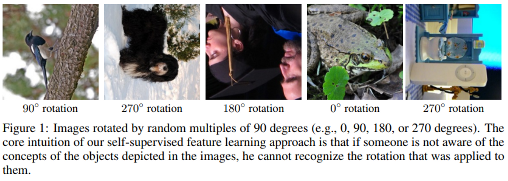
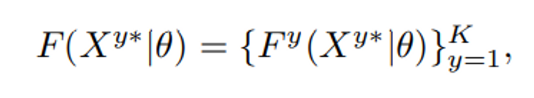
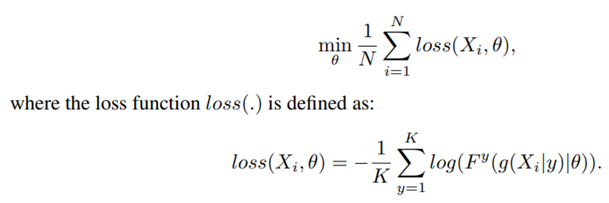
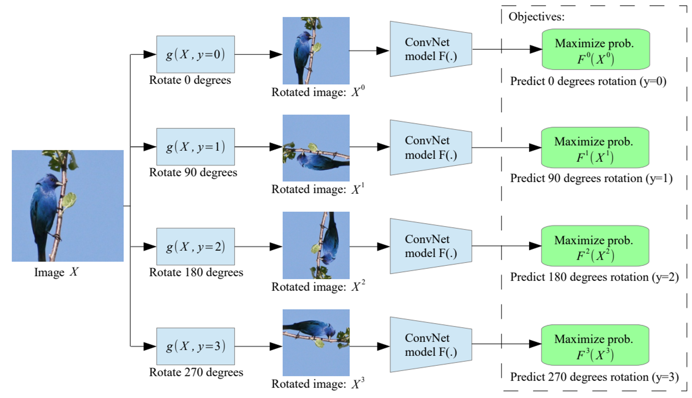
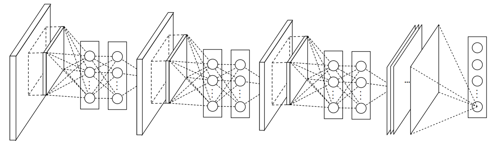
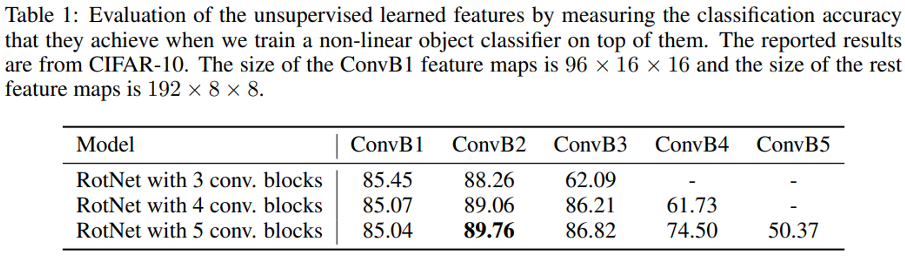
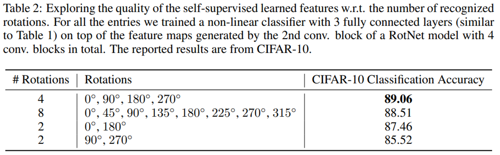
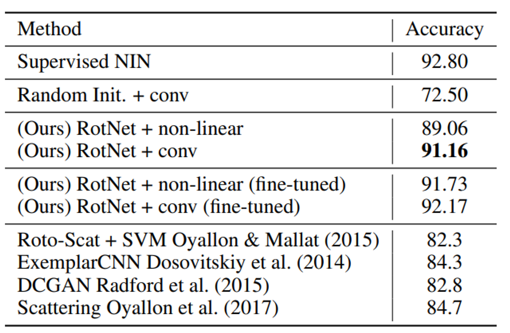

# Predicting Image Rotations
- Title: Self-training with Noisy Student improves ImageNet classification
- Publication: CoRR, 2018
- Link: [[paper](https://arxiv.org/pdf/1803.07728.pdf)] [[code](https://github.com/gidariss/FeatureLearningRotNet)]

## Introduction
- Supervision learning is effective for feature learning, but there must be a lot of labeled data for successful learning.
  - Too expensive in reality, and requires an unrealistic scale
- Using unsupervised semantic feature learning is critical in processing massive data because it doesn't need any effort in labelling

## What is "understanding image?"
- Requiring to understand the concept of the objects depicted in the image
  - Location in the image, their type, and their pose.
- In this thesis, Use rotation transformations to predict image.
  - It should be recongnized even in a rotated state.


## Methodolgy
- F: ConvNet model, G: k distinct geometric variations (not random because they are discrete)
- g: Create converted image X (transformation applied)


- X | (theta): Transformation by changing the angle by theta for input X.


- Minimizing loss is our goal, so we can improve the direction in which loss decreases by comparing the calculations by rotating the angle!

## Choosing gemometric transformation
- In thesis, model are trained by rotating Pi/2 rad.
- To successfully predict the rotation of an image, the model must learn to localize salient objects in the image.
- Recognize their orientation and object type, and then relate the object orientation with each type of object.


## Comparing attention between supervised learning and self-supervised learning
- Self-supervised learning shows better attention maps than supervised learning.


## Benefits of rotation
- computational cost similar to supervised learning.
- Learning speed similar to supervised learning.

## Experiments
- Tests are based on RotNet(Network in Network).

- Multiple rotation blocks, performance best in the 1st or 2nd block above when comparing performance.

- Using four rotations is the best for accuracy.

- supervised NIN and RotNet + conv are the same architectures, and there is no significant difference in performance between supervised and self-supevised learning.


## Reference
```tex
@article{DBLP:journals/corr/abs-1803-07728,
  author       = {Spyros Gidaris and
                  Praveer Singh and
                  Nikos Komodakis},
  title        = {Unsupervised Representation Learning by Predicting Image Rotations},
  journal      = {CoRR},
  volume       = {abs/1803.07728},
  year         = {2018},
  url          = {http://arxiv.org/abs/1803.07728},
  eprinttype    = {arXiv},
  eprint       = {1803.07728},
  timestamp    = {Mon, 13 Aug 2018 16:46:04 +0200},
  biburl       = {https://dblp.org/rec/journals/corr/abs-1803-07728.bib},
  bibsource    = {dblp computer science bibliography, https://dblp.org}
}
```
