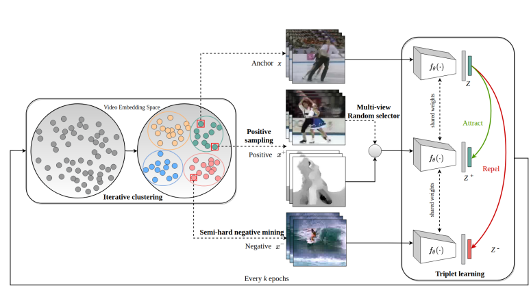
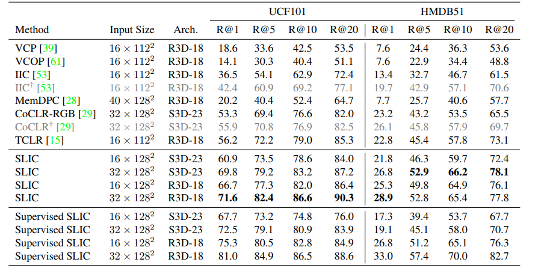

# SLIC
- Title: Self-Supervised Learning with Iterative Clustering for Human Action Videos
- Publication: CVPR, 2022
- Link: [📖](https://arxiv.org/abs/2206.12534) [💻](https://github.com/rvl-lab-utoronto/video_similarity_search)

 
## Introduce 


- This paper suggests a clustering-based self-supervised constrastive learning method for human action videos.
- SLIC improve upon the traditional intra-video positive sampling by using iterative clustering to group similar video instances.
- SLIC alternative between periodically clustering video representations to produce pseudo-labels, and using those pseudo-labels to inform the sampling of positive and negative pairs to update the video representations, by minimizing a triplet margin loss
- SLIC also combines iterative clustering with multi-view encoding and a temporal discrimination loss to learn view-invariant embeddings and fine-grained motion features
- Specifically for sampling harder positives and negatives for contrastive learning and intergrate iterative clustering with multi-view encoding.
- Using FINCH clustering instead k-means and DBSCAN
- They quantify the clustering quality by computing the Normalized Mutual Information(NMI) between the pseudo labels generated by clustering algrithm pseudo labels and the ground truth labels.

## Experiment Results.
- SLIC achieves state-of-the art resutls on video retrieval +15.4% improvement on top-1 recall on UCF101 and +5.7% on HMDB51
 

## Reference
```tex
@inproceedings{khorasgani2022slic,
  title={Slic: Self-supervised learning with iterative clustering for human action videos},
  author={Khorasgani, Salar Hosseini and Chen, Yuxuan and Shkurti, Florian},
  booktitle={Proceedings of the IEEE/CVF Conference on Computer Vision and Pattern Recognition},
  pages={16091--16101},
  year={2022}
}
```
