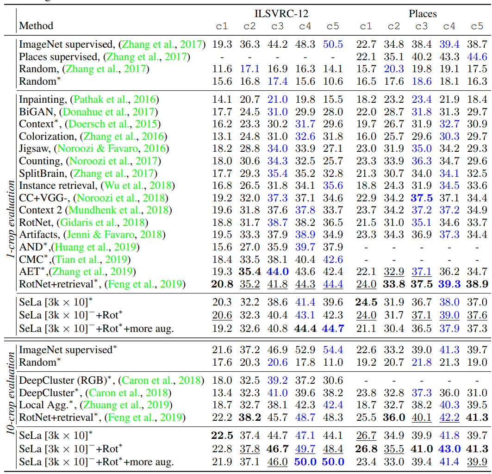
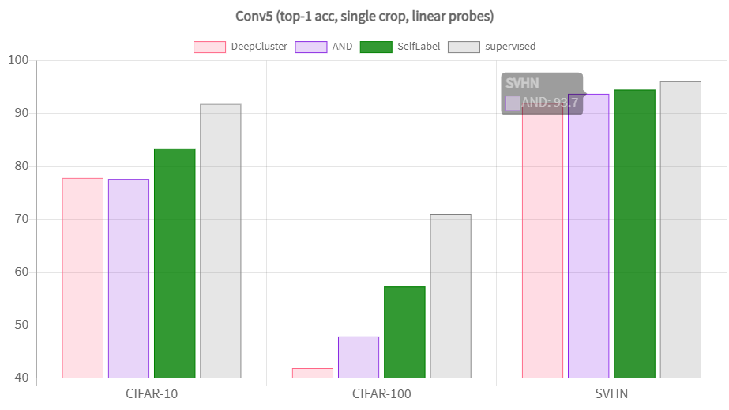
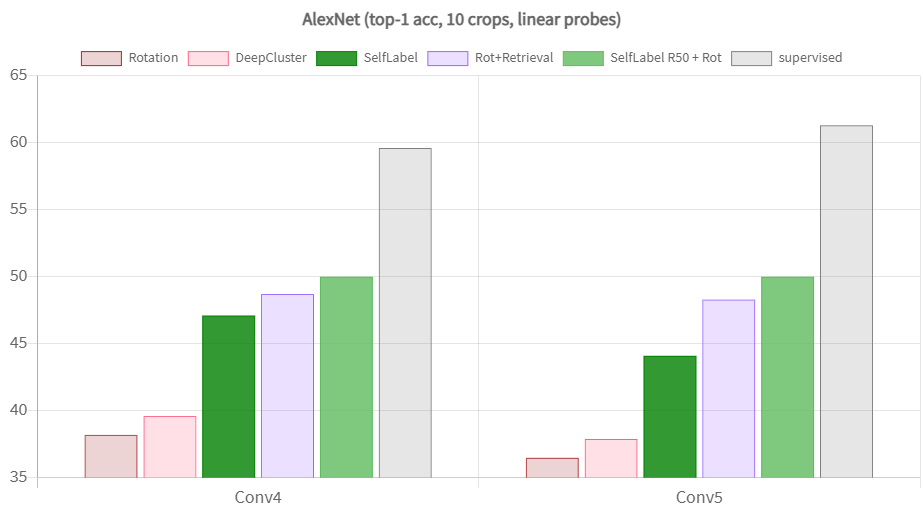

# SeLA
- Title: Self-labeling via simultaneous clustering and representation learning.
- Publication: ICLR, 2020
- Link: [📖(https://arxiv.org/abs/1911.05371)] [💻(https://github.com/yukimasano/self-label)]

 
## Introduce 


- They developed a self-supervised learning formulation that simultaneously learns feature representations
- And useful dataset labels by opimizing the common cross-entropy loss for features and labels, while maximizing information
- This method can be used to generate labels for an any image dataset.
- By using the faint signal generated by a randomly-initialized network, they can bootstrap a first set of image labels that can then be subsequently refined.
- By adding various image transformations such as random crops and color jitters
- It can further enforce invariance of the labelling against these kind of non-semantic transformations and let the network learn to extract more meaningful clusters.
- Compare to DeepCluster, SeLA do not introduces a separate clustering loss, as this leads to degenerate solutions and requires ad-hoc fixes.
- Instead, the novelty in SeLA lies in using a clustering approach that minimizes the same cross-entropy loss that the learning the network also optimizes.
- SeLA do this by incorporating a regularization that our classes should partition the data equally.
- While this sounds potentially limiting, by simply choosing a large enough number of classes
- SeLA can accout for even highly skewed datasets such that on "ture" class might take up multiple of our classes.

## Experiment Results.
- Small-scale: Performance of SeLa on small-scale dataset: CIFAR10/100 and SVHN. SeLa outperform the previous state of the art AND by a significant margin.
 
- Large-scale: Performance of SeLa on large-scale dataset: ImageNet. For the evaluation, the network's weight are frozen and only a linear layer is trained to assess the performance of the feautre maps at various depths of the network.
- Since a linear layer is a relatively weak classifier, this is indicative of how good the CNN is as a feature extractor.
 

## Reference
```tex
@article{asano2019self,
  title={Self-labelling via simultaneous clustering and representation learning},
  author={Asano, Yuki Markus and Rupprecht, Christian and Vedaldi, Andrea},
  journal={arXiv preprint arXiv:1911.05371},
  year={2019}
}
```
