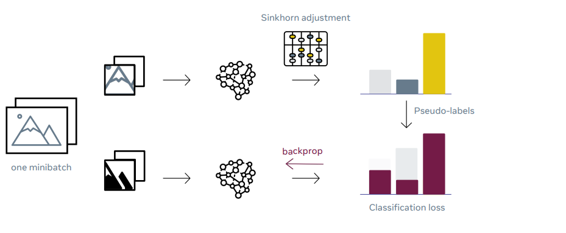
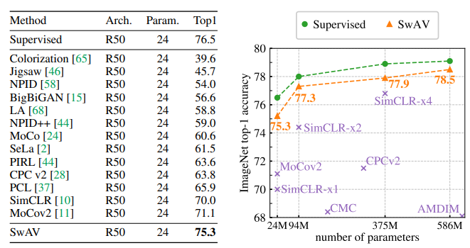

# SwAV
- Title: Unsupervised Learning of Visual Features by Contrasting Cluster Assignments
- Publication: NeurIPS, 2020
- Link: [📖](https://arxiv.org/abs/2006.09882) [💻](https://github.com/facebookresearch/swav)

 
## Introduce 


- This paper suggests a new computationally efficient method for constructing low-dimensional representation of unlabeled data.
- Contrastive learning is a powerful method to learn visual features without supervision.
- Instead of predicting a label associated with an image, contrastive methods train convolutional networks by discriminating between images.
- This approach works well but requires the system to transform the same image in many different ways and compare individually every individually every possible pair of trasformed images.
- This is an extremely computation intensive task.
- So, SwAV propose an alternative that does not require an explicit comparison between every image pair.
- Fisrt compute features of cropped sections of two images and assign each of them to a cluster of images.
- These assignments are done independently and may not match for example, the black-and-white image version of the cat image could be a match with a cluster that contains different cat images.
- Constrain the two cluster assignmednts to match over time, so the system eventually will discover that all the images of cats represent the same information.
- SwAV allows researchers to train efficient, high-performance image classification models with no annotations or metadata.

## Experiment Results.
- SwAV repersentation outperforms supervised representation
 

## Reference
```tex
@article{DBLP:journals/corr/abs-2006-09882,
  author       = {Mathilde Caron and
                  Ishan Misra and
                  Julien Mairal and
                  Priya Goyal and
                  Piotr Bojanowski and
                  Armand Joulin},
  title        = {Unsupervised Learning of Visual Features by Contrasting Cluster Assignments},
  journal      = {CoRR},
  volume       = {abs/2006.09882},
  year         = {2020},
  url          = {https://arxiv.org/abs/2006.09882},
  eprinttype    = {arXiv},
  eprint       = {2006.09882},
  timestamp    = {Tue, 23 Jun 2020 17:57:22 +0200},
  biburl       = {https://dblp.org/rec/journals/corr/abs-2006-09882.bib},
  bibsource    = {dblp computer science bibliography, https://dblp.org}
}
```
